# GenratorFCSkit
GeneratorFCSkit allows to obtain enriched FCS data whose reality is known in order to evaluate results of some cytometry tools for example the evaluation of automatic gating with Cytofkit. 
FCS generated will be able to compare the performances of the algorithms use for automtic gating in Cytofkit with those which one expects in reality(manual gating).
This enrichment is reprented by an additional information called a prediction variable in the FCS files corresponding to an assignment for each cell of the cell population to which it belongs.

Many steps are necessary to obtain this FCS files starting from a normal FCS files (FCS3.0)
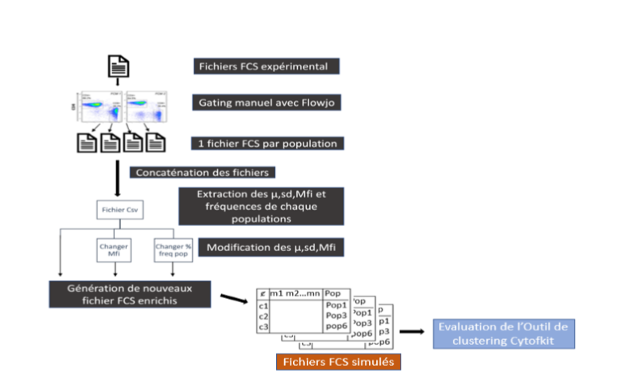

# 01.Exported each Gated Population on Flowjo in single FCS files 

From a gating strategy of a raw FCS file carried out on FlowJo, it is possible to export the populations obtained by the manual gating in FCS file
The gating strategy corresponds to the .wsp file obtained after the gating which can be directly reloaded in Flowjo.
Once the file is loaded, the list of the different populations that have been selected by manual windowing appears like this.

The goal here is to export each population to a separate FCS file and give each file the name of the corresponding poppulation.

To export a particular gated population in Flowjo , highlight the gated subset within a gating tree(either by group or individual samples).

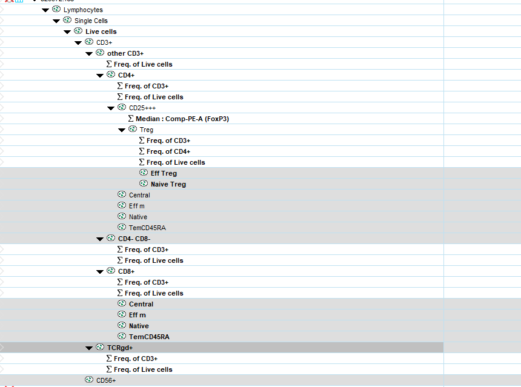

Next, within the Document band of the workspace ribbon (located by default within the File tab), click on the Data Export/Concatenate action button.
Select either Export/Concatenate Populations or Export/Concatenate Group, as appropriate, from the drop down list.

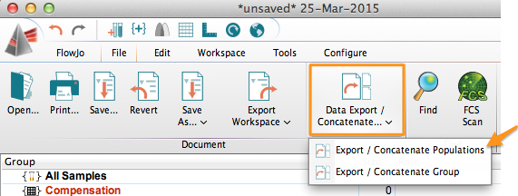

This will bring up a bring up the following Export or Concatenate window.

Clicking on the Advanced Options bar will open additional File Naming options. You can add a Prefix or Suffix to distinguish these files from the originals (export is added as Prefix by default) and even a build a custom file naming scheme using Keywords by choising the radiobutton customize.

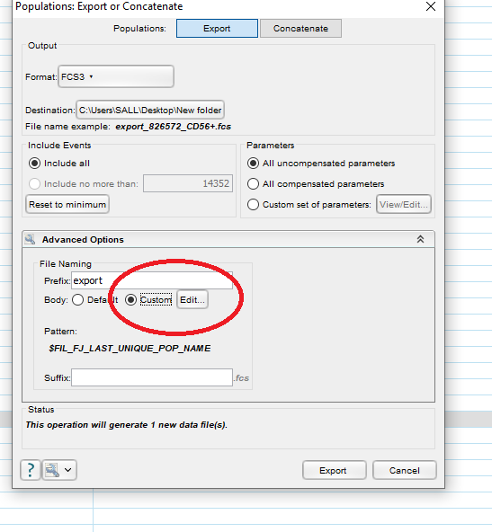

Once these options are set as you like (the Status section at the bottom of the window tells how many files will be generated), click on the Export button at the bottom right of the dialog box. The following dialog box will appear.

When you customize popname, only the keyword FJ_LAST_UNIQUE_POP_NAME must appear in the new popname
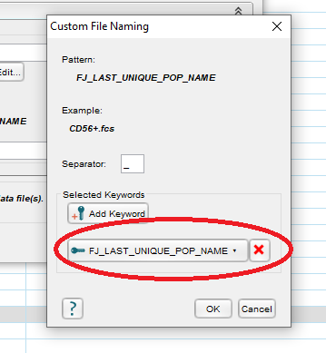

For example for population CD56+ he fcs file name will be CD56+.fcs
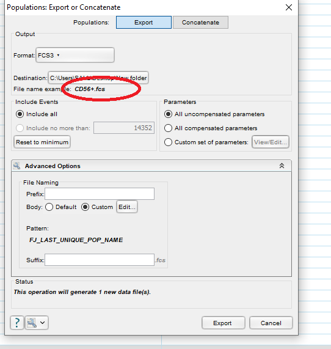

# 02 GeneratorFCSkit

Once user get files corresponding to each population Each population of detected cells population with manual gating, these ones can be import in GeneratorFCSkit, which allows to extract the useful characteristics for their modeling.
GeneratorFCSkit allows to know the percentage of each population within a sample and the most important to allow a user to have control of these frequencies by modulating the MFI and the SFI of markers .

GenratorFCSkit application is divided into 2 tabs

A first a tab for imortingFCS files representing each Population present in an FCS file obtained with Flowjo and the choice of parameters for the generation of a new enriched FCS file.

## 02.1 Parameterization of FCS files to be generated

Importing simulated files
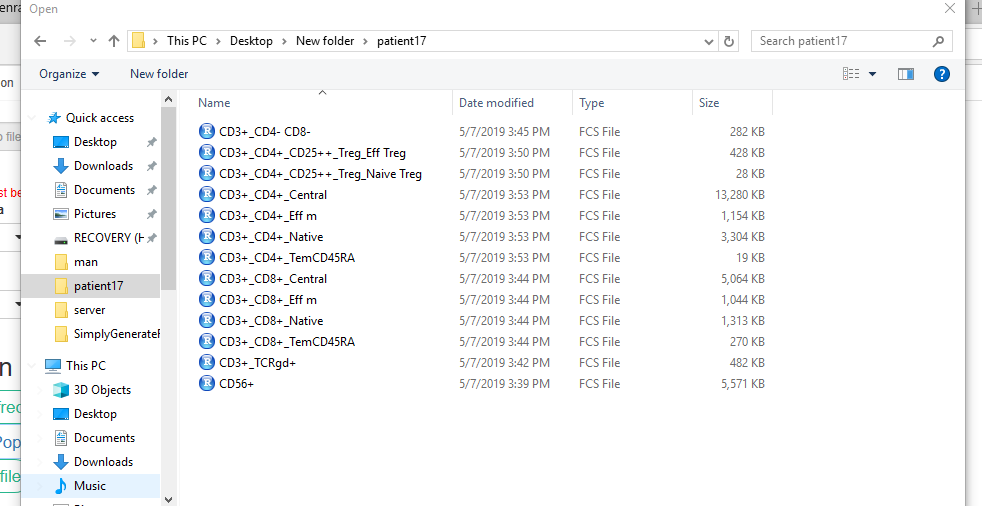

Choice of markers for transformation and compensation

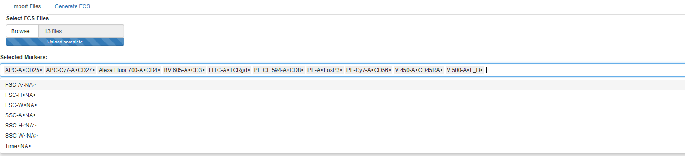

Compensation and Transformation with arcsinh

Extraction of the frequencies of the population (modifiable part by the user)
These characteristics are saved in an Excel file (CSV) which makes it easy to modify them.

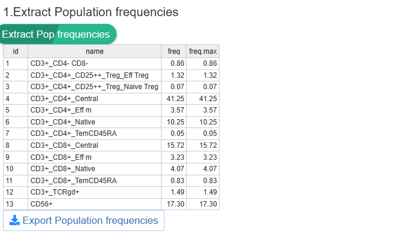

Calculation of Mfi and sdFI of selected markers

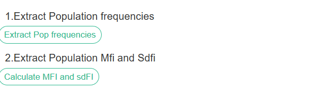

Visualization of the MFIs and SsdFIs of each Markers

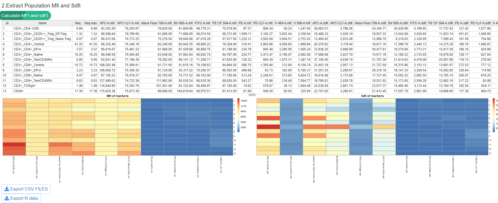

The calculation of the Mfi for each population makes it possible to see the average fluorescence of the markers for a given population.

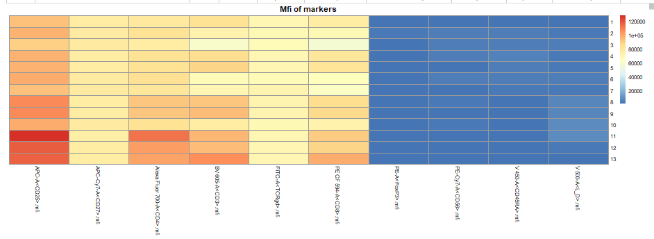

The sdfi allows to check the quality of the manual gating for exampleto see if all populations are well separated
this makes it possible to have information on the potential populations that can be grouped together or that can be redefined due to high values of sdfi. 

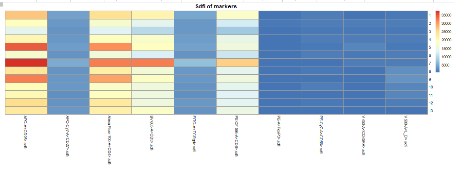

The table of population Mfi and sdFI can also be exported and modified by user 

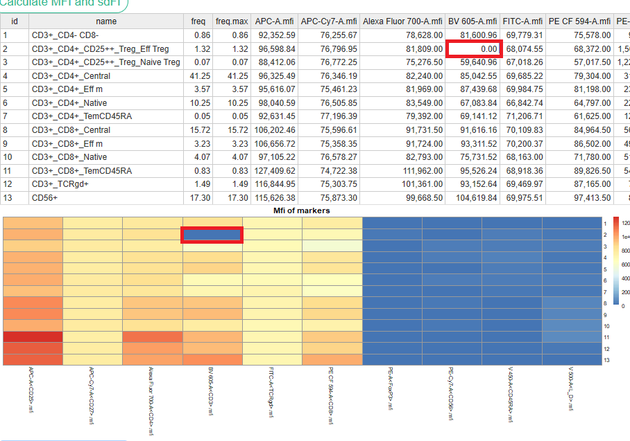

## 02.1 Generating New FCS files according to the mfi and sdfi tab define by user 

A second tab is used to generate one or more FCS file (s) from the MFI and sdFI matrix.
 
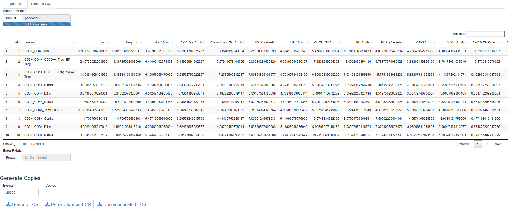

Importing the matrix
Importing the R .data containg the compensation matrix if data have to be decompensated 
Choice of the number of events by files
Choice of the number of Generated files

Optionnaly Generated FCS files can be detransformed (only for arcsinh transformation) or decompensated (if data are previously compensate before genrating)

 
Finnaly this app generate cells having the characteristics described and to group them 
in the same cytometry file by specifying the number of cells desired. It is possible to generate replicas with some variability

The new data includes additional information that makes it possible to know which cell subpopulation belongs to each event.This what is called enriched Fcs files

