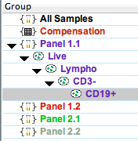
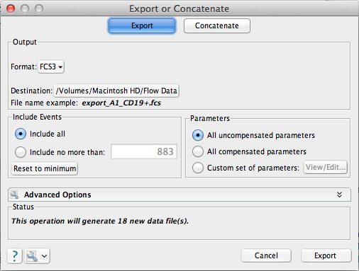
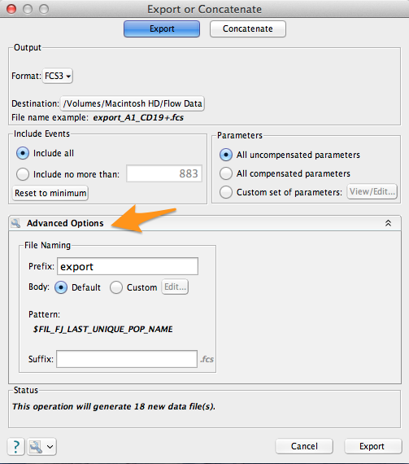

# GenratorFCSkit
GeneratorFCSkit allows to obtain simulated FCS data whose reality is known in order to evaluate results of some cytometry tools for example the
FCS fenerated will be able to compare the performances of the algorithms use for automtic gating in Cytofkit with those which one expects
in reality(manual gating).
This reality is reprented by an additional information called a prediction variable in the FCS files corresponding to an assignment for 
each cell of the cell type to which it belongs have been used.

These files are obtained with Flowjo

# 01.Exported each Gated Population on Flowjo in single FCS files 

From a gating strategy of a raw FCS file carried out on FlowJo, it is possible to export the populations obtained by the manual gating in FCS file
The gating strategy corresponds to the .wsp file obtained after the gating which can be directly reloaded in Flowjo.
Once the file is loaded, the list of the different populations that have been selected by manual windowing appears like this.

The goal here is to export each population to a separate FCS file and give each file the name of the corresponding poppulation.

To export a particular gated population in Flowjo , highlight the gated subset within a gating tree(either by group or individual samples).

Next, within the Document band of the workspace ribbon (located by default within the File tab), click on the Data Export/Concatenate action button.
Select either Export/Concatenate Populations or Export/Concatenate Group, as appropriate, from the drop down list.

This will bring up a bring up the following Export or Concatenate window.

Clicking on the Advanced Options bar will open additional File Naming options. You can add a Prefix or Suffix to distinguish these files from the originals (export is added as Prefix by default) and even a build a custom file naming scheme using Keywords.

Once these options are set as you like (the Status section at the bottom of the window tells how many files will be generated), click on the Export button at the bottom right of the dialog box. The following dialog box will appear.

once Each population of detected cells is isolated and exported as a single file. 
Once user get files corresponding to each population and annotated with the name of the populations, these ones can be import in GeneratorFCSkit,which allows to extract the useful characteristics for their modeling.
A pipeline that takes these different files as input has been created which allows to know the percentage of each population within a sample and the most important to allow a user to have control of these frequencies by modulating the MFI, as markers calculated from this pipeline.

#02 GenratorFCSkit Funtionality

These characteristics are saved in an Excel file (CSV) which makes it easy to modify them, such as their frequency. 
A pipeline then makes it possible to generate cells having the characteristics described and to group them 
in the same cytometry file by specifying the number of cells desired. It is possible to generate replicas with some variability

The new data includes additional information that makes it possible to know which cell subpopulation belongs to each event.
